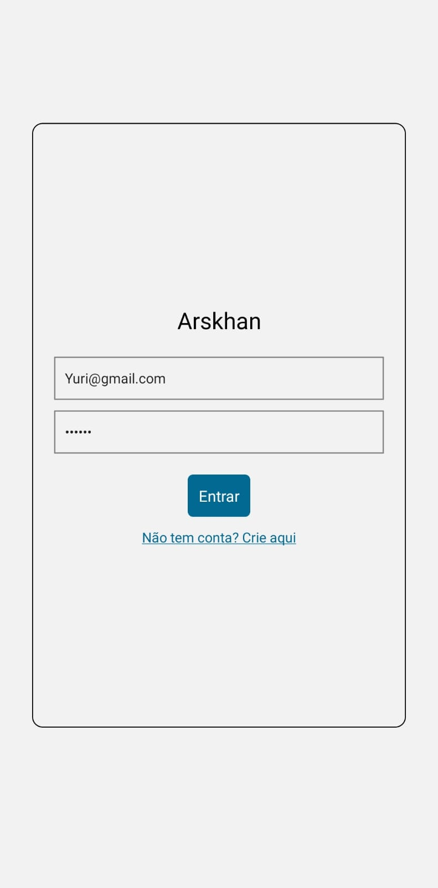
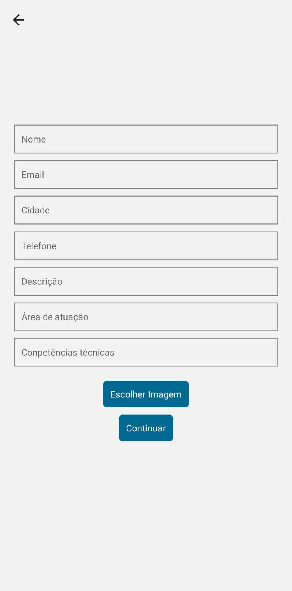

# Arskhan - Conectando Empresas e Candidatos

## **Introdução**

O Arskhan é um projeto desenvolvido para simplificar a busca por emprego, proporcionando uma experiência inovadora e confortável para os usuários. O aplicativo conecta empresas em busca de novos talentos a candidatos em busca de oportunidades profissionais, com a #interação acontecendo de forma intuitiva e eficaz.

## **Desenvolvimento Prático**

**Aplicativo** (React Native, Expo, Firebase)

O aplicativo Arskhan foi desenvolvido utilizando React Native e Expo, aproveitando as facilidades dessas tecnologias para criar uma experiência de usuário única. O Firebase foi adotado como banco de dados para armazenar informações de usuários e empresas. O processo de desenvolvimento inclui:

- Login e Cadastro: Implementação de um sistema de autenticação que permite aos usuários criar contas e realizar o login.

  
  

- Procura de Empresas: A principal funcionalidade do aplicativo é a busca de empresas. Elas são apresentadas aos usuários por meio de uma imagem do ambiente (interno ou externo) juntamente com seu nome. Botões "Saiba Mais", "Like" e "Próximo" proporcionam uma interação fácil, rápida e intuitiva.
 
 
  
  
 

- Detalhes da Empresa: Ao clicar em "Saiba Mais", o aplicativo recupera informações da empresa do Firebase, fornecendo uma visão mais detalhada sobre a vaga.

**Site** (HTML, CSS, JavaScript, Firebase)

O site corporativo foi desenvolvido utilizando HTML, CSS e JavaScript, com o Firebase como backend para armazenamento de dados. O Realtime Database do Firebase gerencia informações de usuários e empresas, enquanto o Storage é utilizado para armazenar imagens. As funcionalidades incluem:

- Cadastro e Login: Telas padrão para empresas acessarem o sistema.

- Interação com Candidatos: As empresas visualizam candidatos que mostraram interesse através do aplicativo. Esse recurso possibilita à empresa avaliar perfis, fornecer feedback e decidir sobre entrevistas ou contratações futuras.

## Como usar
Para iniciar o aplicativo, primeiro é preciso criar um projeto no Firebase https://console.firebase.google.com/u/0/?hl=pt, o que é bastante simples. Basta fornecer um nome para o projeto, aceitar os termos de uso e coletar as informações do seu banco de dados em "Configurações do projeto". Recomendo este vídeo tutorial para orientações detalhadas https://youtu.be/yBJD4ply2k0?si=tmsY9H2SnFmCJJnD.

Após isso, o próximo passo é usar os seguintes comandos:
- npm install -g expo-cli para facilitar na hora de emular seu projeto e otimizar outras coisas, como já instalar algumas bibliotecas e criar arquivos que vão facilitar na hora de compilar o código.
- expo init NomeDoProjeto para finalmente criar seu projeto.
- cd NomeDoProjeto para entrar na pasta do seu projeto.
- npm install para baixar todas as bibliotecas do JSON.
- expo start para iniciar o projeto.
Eu utilizei o app Expo Go para emular o projeto no meu Android https://play.google.com/store/apps/details?id=host.exp.exponent.

## **Considerações Finais**
O projeto Arskhan foi desafiador, proporcionando aprendizados significativos tanto em competências técnicas quanto em soft skills. A resolução de problemas técnicos, pesquisa intensiva e a superação de desafios contribuíram para o crescimento das competências técnicas. As soft skills, como trabalho em equipe, divisão de tarefas, compreensão da lógica de banco de dados e design, foram aprimoradas ao longo do desenvolvimento.

Arskhan representa não apenas um aplicativo, mas uma solução que aproxima empresas e candidatos de maneira simples e eficiente.

## **Referencias**
### **Firebase**
- https://firebase.google.com/docs?hl=pt-br
- https://youtu.be/7ol2DgfzvC4?si=googNGfs3AXSZG1z
### **Expo**
- https://docs.expo.dev/
- https://youtu.be/ql4J6SpLXZA?si=kFVLMcOMVA9cdX7w
### **React Native**
- https://reactnative.dev/docs/getting-started
